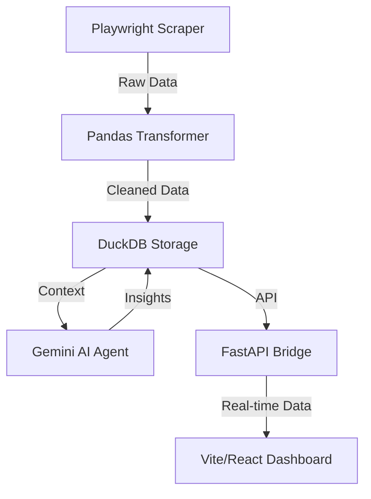

# AI Data Insight

AI Data Insight is a sophisticated, agent-driven platform designed to scrape, transform, and analyze market data using advanced AI models. It features a robust data pipeline and a premium hybrid UI for real-time strategic intelligence.

## 🏗️ Architecture

The system follows a modular pipeline architecture:



### Core Components
- **Agents**: 
  - `scraper_agent.py`: Uses Playwright to harvest data from financial sources.
  - `transform_agent.py`: Cleans and structures data using Pandas.
  - `insight_agent.py`: Leverages Google Gemini (Flash) to generate strategic market intelligence.
- **Database**: DuckDB serves as a high-performance OLAP store for both raw data and AI insights.
- **API Bridge**: A FastAPI layer that serves data to the frontend.
- **Frontend**: A modern, glassmorphic React dashboard (available as both a standalone HTML and a Vite project).

## 🚀 Features

- **Automated Data Harvesting**: Intelligent scraping of market tickers and financial news.
- **AI-Powered Intelligence**: Strategic sentiment analysis, risk assessment, and key takeaways generated by Gemini.
- **Hybrid UI**: 
  - A premium **Vite + React** frontend with Lucide icons and Tailwind CSS.
  - A **Standalone HTML** dashboard for quick deployment.
- **Unified Data Storage**: Persistent storage of historical data and insights via DuckDB.

## 🛠️ Technology Landscape

| Layer | Technologies |
| :--- | :--- |
| **Backend** | Python 3.11+, FastAPI, Uvicorn |
| **Data Processing** | Pandas, DuckDB |
| **AI / LLM** | Google Gemini (generative-ai) |
| **Automation** | Playwright |
| **Frontend** | React, TypeScript, Vite, Tailwind CSS, Lucide React |

## 🚦 Getting Started

### Prerequisites
- Python 3.11 or higher
- Node.js (for the Vite frontend)
- [Gemini API Key](https://aistudio.google.com/)

### Installation

1. **Clone the repository**:
   ```bash
   git clone <repository-url>
   cd AI_Data_Insights
   ```

2. **Setup Backend**:
   ```bash
   # Install dependencies using uv or pip
   pip install -r requirements.txt
   # Setup Playwright
   playwright install chromium
   ```

3. **Configure Environment**:
   Create a `.env` file or export your Gemini API key:
   ```bash
   export GEMINI_API_KEY="your_api_key_here"
   ```

### Execution Steps

1. **Run the Data Pipeline**:
   This will scrape data, transform it, and generate AI insights.
   ```bash
   python main.py
   ```

2. **Start the API Bridge**:
   ```bash
   python api_bridge.py
   ```

3. **Launch the Dashboard**:
   - **Modern UI (Recommended)**:
     ```bash
     cd frontend
     npm install
     npm run dev
     ```
   - **Quick Look**: Open `standalone_ui.html` in your browser or visit `http://localhost:8000/` while the API bridge is running.

## 📊 Uses

- **Market Trend Monitoring**: Track real-time price changes and volume.
- **Portfolio Strategy**: Use AI-generated takeaways for informed decision making.
- **Competitive Analysis**: Scrape and compare data across different financial entities.
- **Historical Analysis**: Review archived insights stored in the local database.

---
*Built with ❤️ using Agentic AI workflows.*
